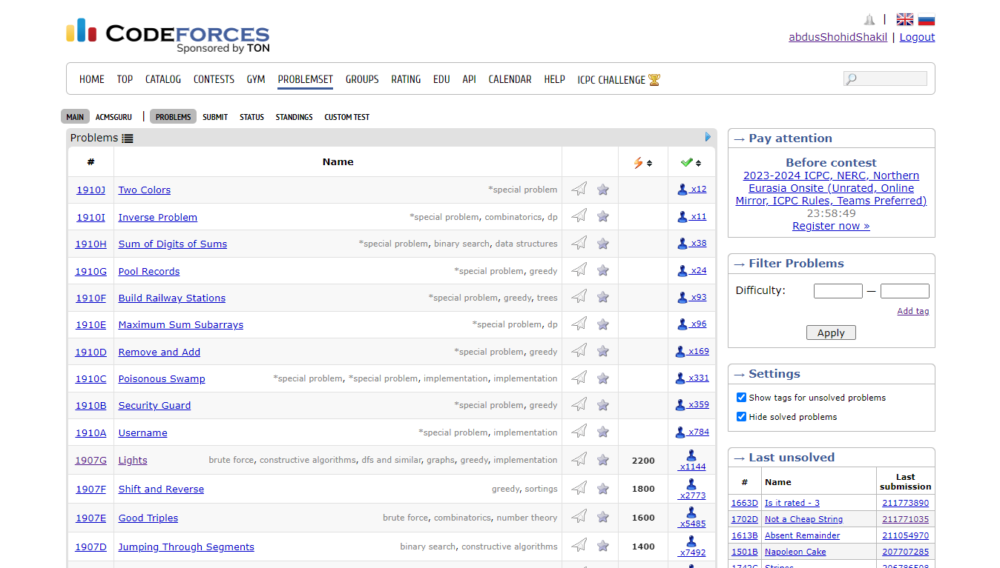
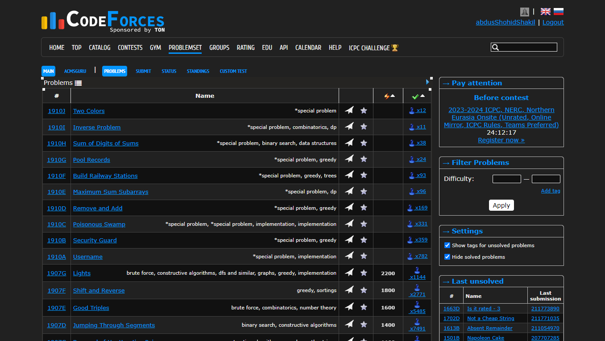
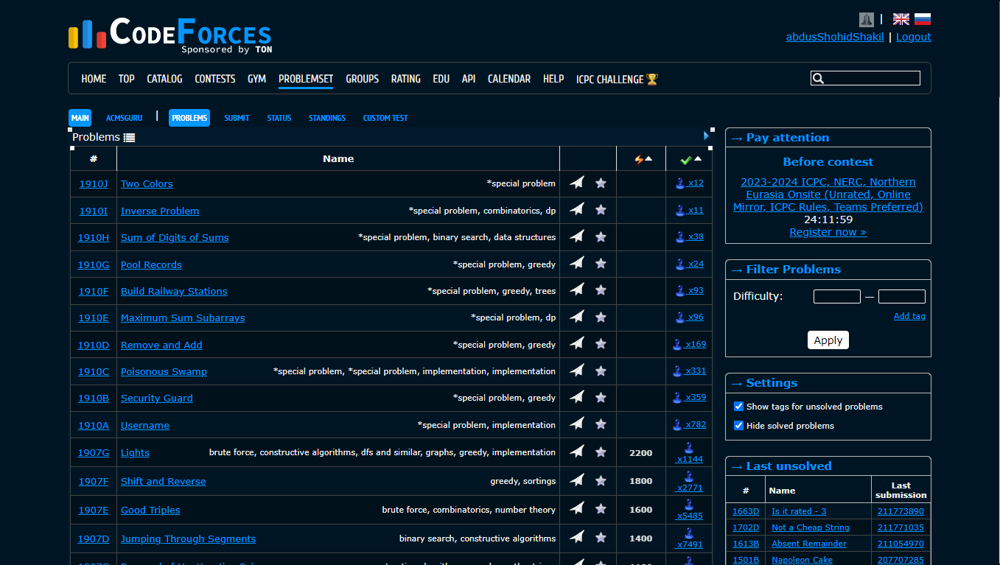
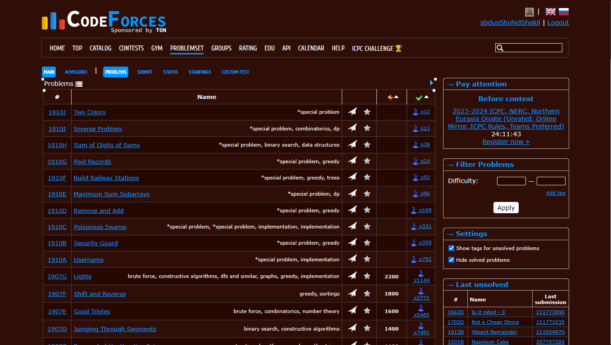
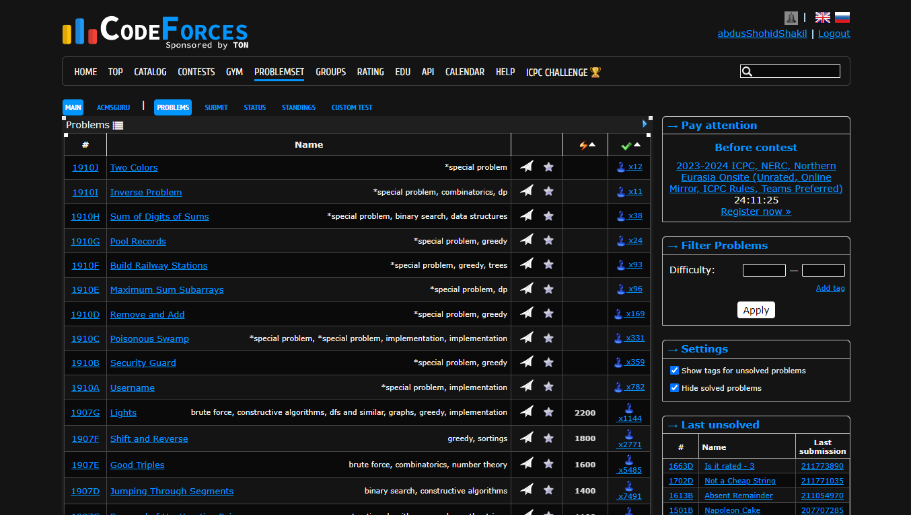
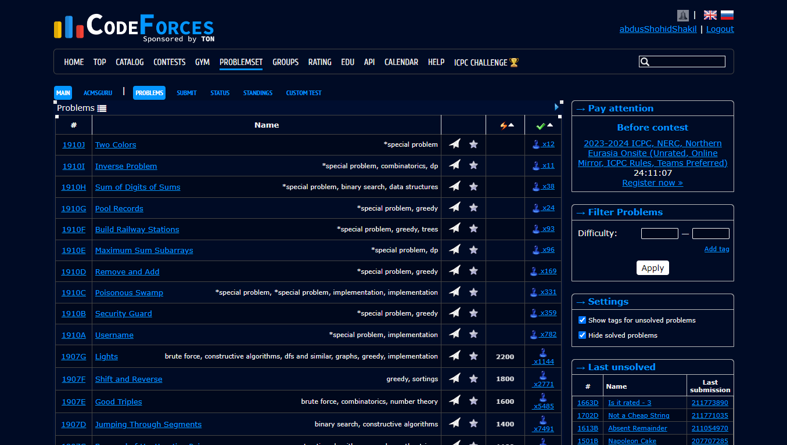
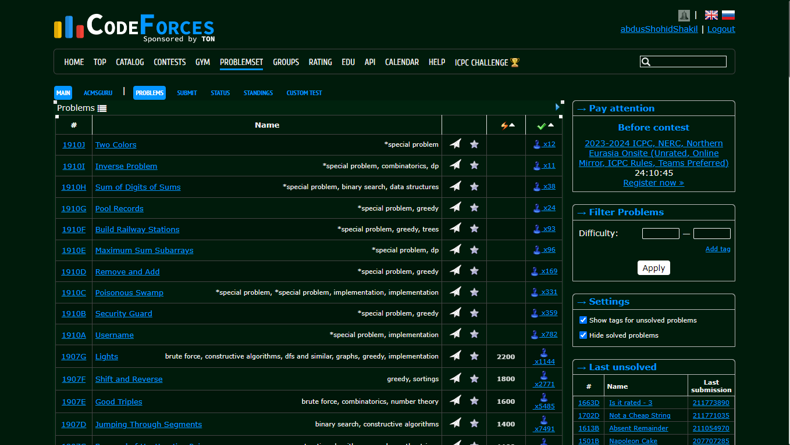
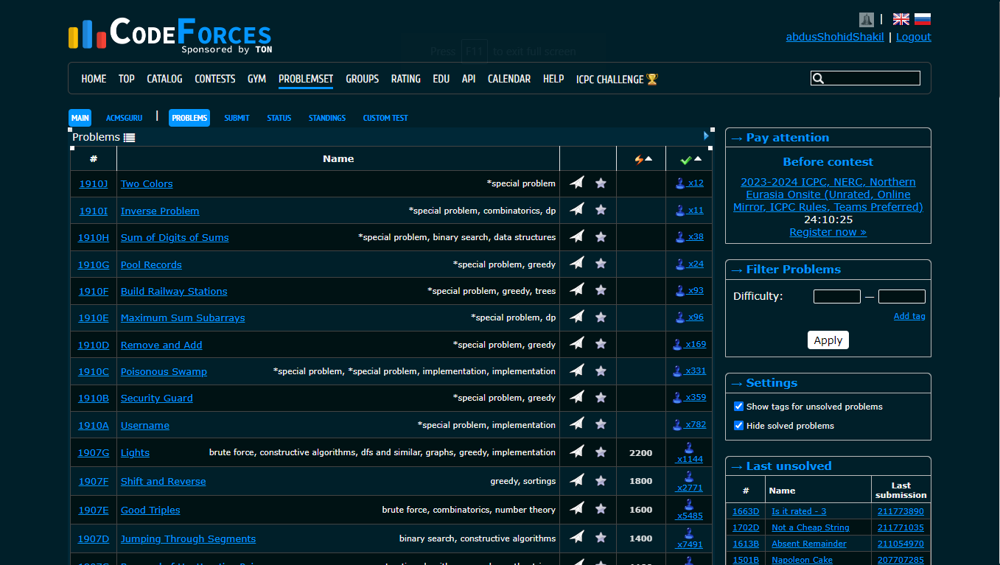
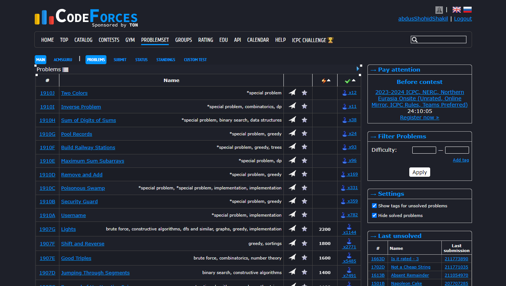
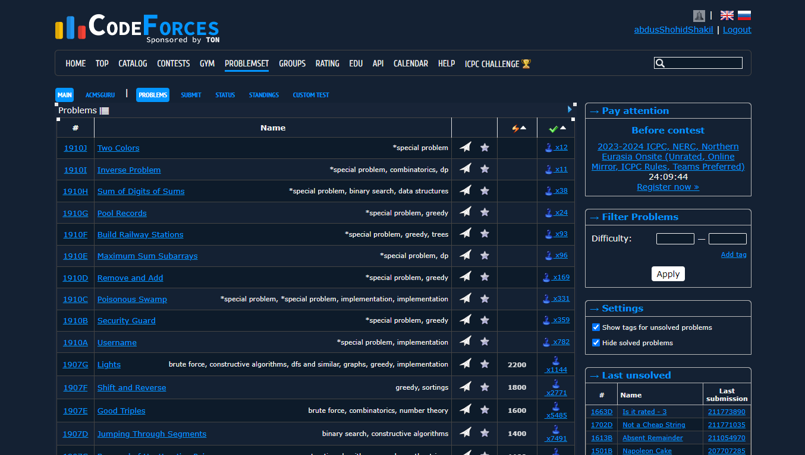

# CF Dark

<p align="center">
  
</p>

<p align="center">
  <a href="https://github.com/developerHub01/CF_Dark/stargazers"></a>
  <a href="https://github.com/developerHub01/CF_Dark/network/members"></a>
  <a href="https://github.com/developerHub01/CF_Dark/issues"></a>
</p>

**CF Dark** is a premium browser extension designed to transform your [Codeforces](https://codeforces.com/) experience. It provides 9 meticulously crafted dark themes to reduce eye strain and enhance your coding performance during late-night competitive programming sessions.

[Live Demo](https://cf-dark.vercel.app/) • [Install Extension](#-installation) • [Report Issue](https://github.com/developerHub01/CF_Dark/issues)

---

## ✨ Key Features

- 🎨 **9 High-Fidelity Themes**: From deep blacks to elegant dracula-inspired palettes.
- ⚡ **Zero Latency**: Lightweight vanilla JS implementation ensures no impact on site performance.
- 🛠️ **Seamless Integration**: Works across all Codeforces modules (Contests, Gym, Problemset, Blogs).
- 🖱️ **Instant Switching**: Change themes on the fly via the intuitive extension popup.
- 🔒 **Privacy First**: No telemetry, no ads, no data collection.

---

## 📸 Gallery

<p align="center">
  
</p>

<details>
<summary><b>View All Theme Variations</b></summary>

|                      Theme 1                      |                      Theme 2                      |                      Theme 3                      |
| :-----------------------------------------------: | :-----------------------------------------------: | :-----------------------------------------------: |
|  |  |  |
|                    **Theme 4**                    |                    **Theme 5**                    |                    **Theme 6**                    |
|  |  |  |
|                    **Theme 7**                    |                    **Theme 8**                    |                    **Theme 9**                    |
|  |  |  |

</details>

---

## 🚀 Installation

### Manual Installation (Developer Mode)

Since the extension is open-source, you can install it directly from the source:

1.  **Clone the Repository**:
    ```bash
    git clone https://github.com/developerHub01/CF_Dark.git
    ```
2.  **Open Extensions Page**:
    Navigate to `chrome://extensions` in your browser.
3.  **Enable Developer Mode**:
    Toggle the switch in the top-right corner.
4.  **Load Unpacked**:
    Click the "Load unpacked" button and select the `extension` folder from the cloned repository.

---

## 💻 Tech Stack

- **Extension**: Vanilla JavaScript, CSS3, HTML5 (Manifest V3).
- **Website**: [Astro](https://astro.build/), Tailwind CSS, Phosphor Icons.

---

## 🤝 Contributing

We welcome contributions! Whether it's adding a new theme or fixing a bug, feel free to open a PR.

1. Fork the repo.
2. Create your branch (`git checkout -b feature/NewTheme`).
3. Commit your changes (`git commit -m 'Add NewTheme'`).
4. Push to the branch (`git push origin feature/NewTheme`).
5. Open a Pull Request.

---

## 👤 Author

**Abdus Shohid Shakil**

- GitHub: [@developerHub01](https://github.com/developerHub01)
- Portfolio: [shakil.dev](https://shakil102043.vercel.app/)

---

<p align="center">
  Made with ❤️ by <a href="https://github.com/developerHub01">Shakil</a>
</p>
